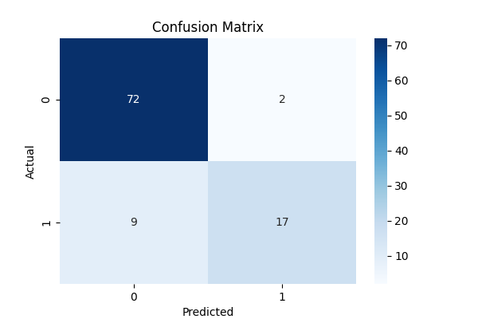
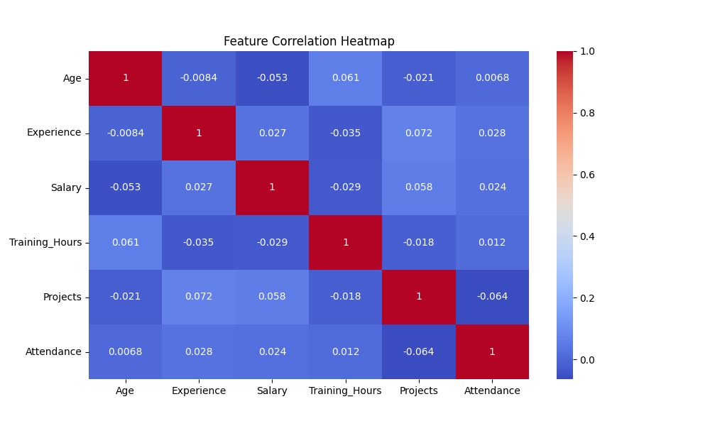
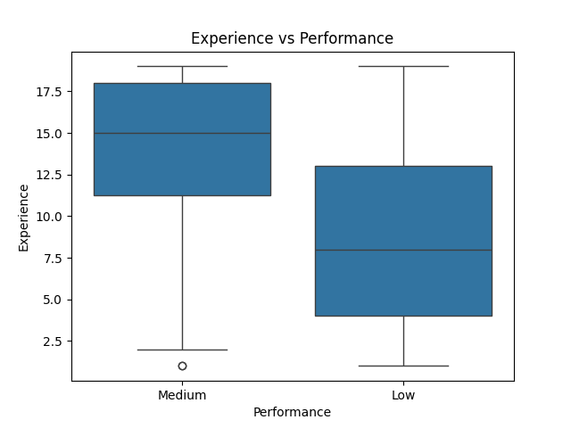
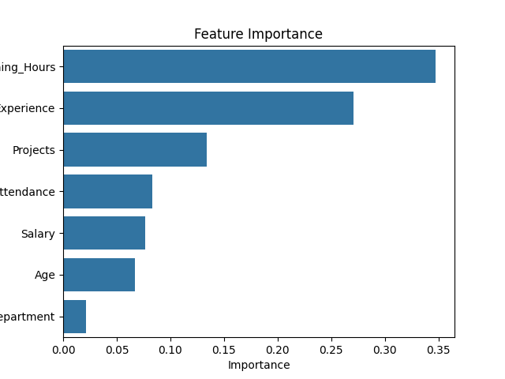
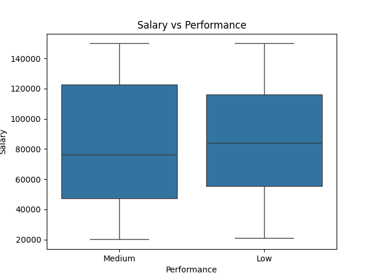
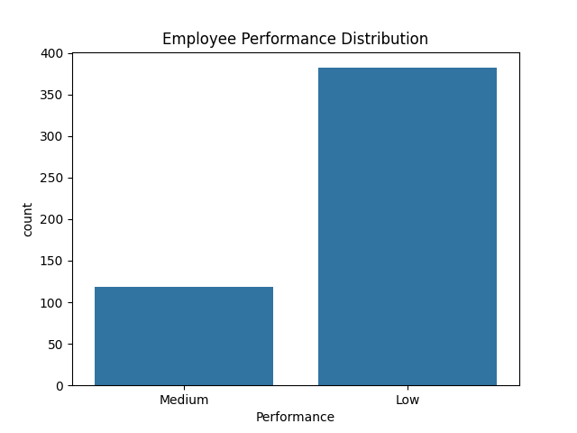
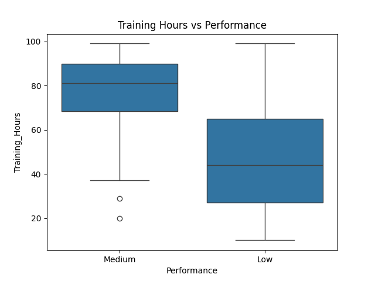
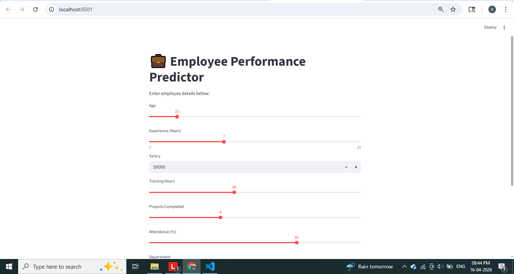
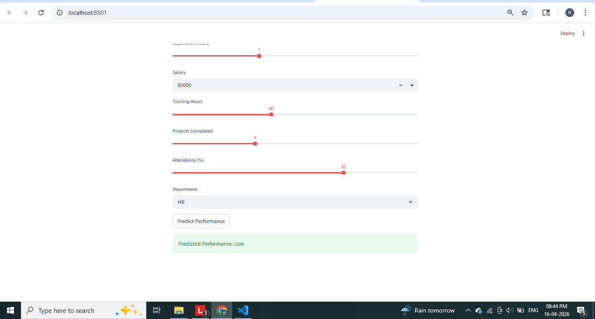

# 💼 Employee Performance Predictor using Machine Learning

## 📌 Project Overview

This project predicts employee performance using Machine Learning based on various factors like experience, salary, training hours, and attendance.

It helps HR teams make **data-driven decisions** for:

* Promotions
* Training programs
* Employee evaluation
* Performance improvement

---

## 🎯 Problem Statement

Organizations often struggle to evaluate employee performance objectively. This project uses data analytics and ML to **predict performance levels (Low, Medium, High)**.

---

## 💡 Business Value

* Identify high-performing employees
* Detect low performers early
* Improve training strategies
* Support HR decision-making
* Reduce bias in evaluations

---

## 🧠 Tech Stack

* Python
* Pandas, NumPy
* Matplotlib, Seaborn
* Scikit-learn
* Streamlit (Frontend)

---

## 🏗️ Project Architecture

Data → Preprocessing → EDA → Feature Engineering → Model → Prediction → UI

---

## 📊 Features Used

* Age
* Experience
* Salary
* Training Hours
* Projects Completed
* Attendance
* Department

---

## 🤖 Machine Learning Model

* Random Forest Classifier

---

## 📈 Results

* Achieved high accuracy in predicting employee performance
* Key influencing factors:

  * Training Hours
  * Experience
  * Projects Completed

---

## 🖥️ How to Run

### Step 1: Clone repository

```
git clone <your-repo-link>
cd employee-performance-predictor
```

### Step 2: Activate environment

```
env\Scripts\activate
```

### Step 3: Install dependencies

```
pip install -r requirements.txt
```

### Step 4: Run backend

```
python src/data_generation.py
python src/model.py
```

### Step 5: Run frontend

```
streamlit run app.py
```

---

## 📸 Screenshots










### 🔹 Web App UI



---

## 🚀 Future Improvements

* Real-world HR dataset
* Deep learning models
* Employee attrition prediction
* Dashboard integration (Power BI / Tableau)

---

## 👩‍💻 Author

Rakshitha A S

---

## ⭐ If you like this project, give it a star!
